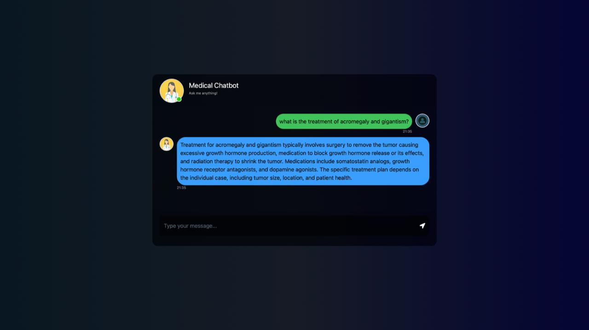
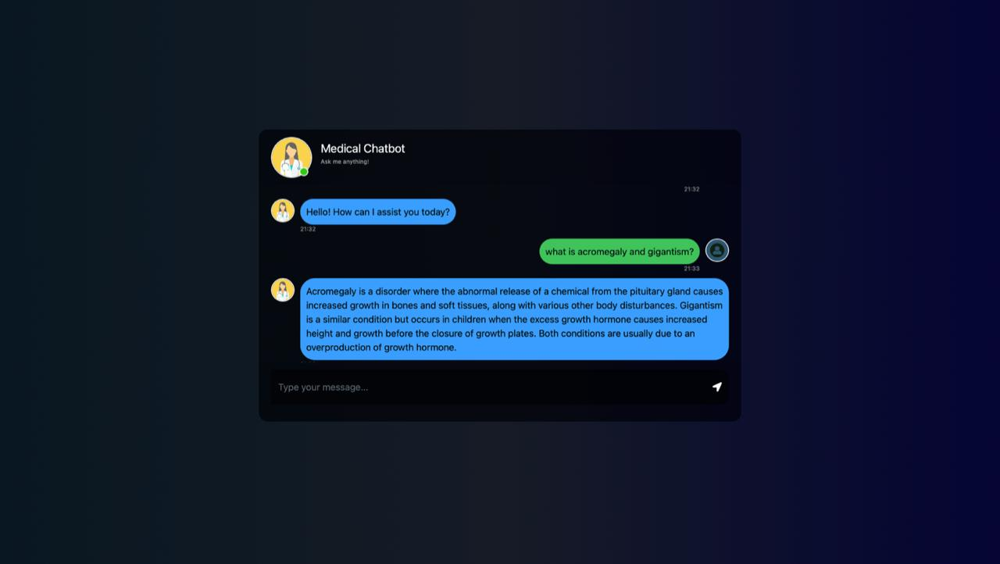

<div align="center">

# 🏥 AI-Powered Medical Chatbot

### Retrieval-Augmented Generation · Flask · Pinecone · OpenAI GPT-4 · AWS EC2


</div>

---

> ⚠️ **Medical Disclaimer:** This chatbot is for **educational purposes only**. It is **not** a substitute for professional medical diagnosis or treatment. Always consult a qualified healthcare provider.

---

## 📖 About the Project

This is an end-to-end **AI-Powered Medical Chatbot** built using **Retrieval-Augmented Generation (RAG)**. Traditional LLMs hallucinate when asked about specialized documents — RAG solves this by first *retrieving* the most relevant chunks from a trusted knowledge base, then *generating* a grounded answer from them.

The knowledge base is built from the **Gale Encyclopedia of Medicine (Volume 1, A–B)** — a trusted, comprehensive medical reference. Documents are chunked, embedded into vectors via `all-MiniLM-L6-v2`, and stored in **Pinecone** for fast semantic search.

> 🎓 Developed as Mini Project (EEC 613) for B.Tech — Department of Computer Science & Engineering, Techno College of Engineering Agartala · Academic Session 2025–2026

---

## 📊 Performance at a Glance

| Metric | RAG-Augmented Chatbot | Plain LLM (GPT-3.5) |
|--------|----------------------|---------------------|
| ✅ Factual Accuracy | **96.8%** | 81.3% |
| ✅ Hallucination Rate | **3.2%** | 18.7% |
| ✅ Relevant Doc Retrieval | **94.5%** | — |
| ✅ Answer Relevance | **92.3%** | — |
| ⏱️ Avg End-to-End Latency | **~2.85s** | — |
| 📚 Source Grounded | **Yes — Gale Encyclopedia** | No (training data only) |
| ⚕️ Disclaimer Included | **Every response** | Inconsistent |

---

## 🖥️ Demo — Live Chatbot Output

Below are real screenshots from the deployed Medical Chatbot, showing grounded responses retrieved from the Gale Encyclopedia of Medicine.

<table>
<tr>

<td width="50%">

### 💬 Query: What is acromegaly and gigantism?



</td>

<td width="50%">

### 💬 Query: Treatment of acromegaly and gigantism?



</td>

</tr>
</table>

> Each response is grounded in the Gale Encyclopedia of Medicine — no hallucinations, no guessing. A medical disclaimer is always appended.

---

## ⚡ Why RAG?

Traditional LLMs **cannot answer questions about your private documents** — they only know what they were trained on.

**RAG (Retrieval-Augmented Generation)** solves this by:

1. **Retrieving** the most relevant chunks from your document
2. **Injecting** those chunks as context into the LLM prompt
3. **Generating** a grounded, accurate answer — not a hallucination

```
Without RAG  →  LLM guesses from training data  →  Often wrong or outdated
With RAG     →  LLM reads YOUR document first   →  Accurate, grounded answers
```

---

## 🏗️ System Architecture & RAG Pipeline

The system operates in **two distinct phases**:

```
╔══════════════════════════════════════════════════════════════╗
║              MEDICAL CHATBOT — RAG PIPELINE                  ║
╠══════════════════════════════════════════════════════════════╣
║  PHASE 1 · OFFLINE — Knowledge Base Preparation              ║
║                                                              ║
║  📄 Medical PDFs                                             ║
║       │                                                      ║
║       ▼                                                      ║
║  [PyPDFLoader]  ──►  Load raw text from Gale Encyclopedia    ║
║       │                                                      ║
║       ▼                                                      ║
║  [CharacterTextSplitter]  ──►  500-char chunks, 20 overlap   ║
║       │                                                      ║
║       ▼                                                      ║
║  [HuggingFaceEmbeddings]  ──►  all-MiniLM-L6-v2 (384-dim)    ║
║       │                                                      ║
║       ▼                                                      ║
║  [Pinecone Vector Store]  ──►  Store & index all vectors     ║
║                                                              ║
╠══════════════════════════════════════════════════════════════╣
║  PHASE 2 · ONLINE — Query Processing & Inference             ║
║                                                              ║
║  💬 User Question (Flask UI)                                 ║
║       │                                                      ║
║       ▼                                                      ║
║  [Embed Query]  ──►  same all-MiniLM-L6-v2 model             ║
║       │                                                      ║
║       ▼                                                      ║
║  [FAISS Retriever]  ──►  Find Top-K=3 relevant chunks        ║
║       │                                                      ║
║       ▼                                                      ║
║  [Prompt Builder]  ──►  Context + Question + System Prompt   ║
║       │                                                      ║
║       ▼                                                      ║
║  [OpenAI GPT-4]  ──►  Generate grounded medical response     ║
║       │                                                      ║
║       ▼                                                      ║
║  ✅ Response + Medical Disclaimer  ──►  Returned to User     ║
╚══════════════════════════════════════════════════════════════╝
```

---

## 🛠️ Technology Stack

<table>
<tr>
<th>Component</th>
<th>Technology</th>
<th>Purpose</th>
</tr>

<tr>
<td>

 Orchestration
</td>
<td>LangChain 0.1.0</td>
<td>RAG chain & RetrievalQA pipeline</td>
</tr>

<tr>
<td>

 Vector Database
</td>
<td>Pinecone</td>
<td>Managed semantic vector search</td>
</tr>

<tr>
<td>

 LLM
</td>
<td>OpenAI GPT-4 / GPT-3.5</td>
<td>Response generation</td>
</tr>


<tr>
<td>

 Embeddings
</td>
<td>HuggingFace <code>all-MiniLM-L6-v2</code></td>
<td>384-dim text embeddings</td>
</tr>

<tr>
<td>

 Web Framework
</td>
<td>Flask 2.3.0</td>
<td>REST API & web interface</td>
</tr>

<td>

 Cloud
</td>
<td>AWS EC2</td>
<td>Deployment & hosting</td>
</tr>

<tr>
<td>

 Container
</td>
<td>Docker</td>
<td>Containerisation</td>
</tr>

<tr>
<td>

 Knowledge Base
</td>
<td>Gale Encyclopedia of Medicine</td>
<td>Authoritative medical reference</td>
</tr>

</table>

---

## 📁 Project Structure

```
medchatbot-using-flask-aws-pinecone/
│
├── 📁 src/medical_chatbot/       # Core Python package
│   ├── __init__.py
│   ├── helper.py                 # Chunking & embedding helpers
│   └── prompt.py                 # Prompt template definitions
│
├── 📁 templates/
│   └── chat.html                 # Chat UI (Flask renders this)
│
├── 📁 static/                    # CSS & JS assets
├── 📁 data/                      # Medical PDFs (Gale Encyclopedia)
├── 📁 research/                  # Jupyter notebooks / experiments
│
├── 🐍 app.py                     # Flask app — main entry point
├── 🐍 store_index.py             # PDF ingestion → Pinecone indexing
├── 🐍 setup.py                   # Package setup
├── 📄 requirements.txt           # Python dependencies
├── 🐚 template.sh                # AWS EC2 bootstrap script
├── 🐳 Dockerfile                 # Docker container config
├── 🔒 .env                       # API keys (never commit!)
└── 📖 README.md
```

---

## 📦 Requirements (`requirements.txt`)

Install all dependencies with:

```bash
pip install -r requirements.txt
```

| Package | Version | Purpose |
|---------|---------|---------|
| `Flask` | 2.3.0 | Web server & REST API |
| `langchain` | 0.1.0 | RAG chain orchestration |
| `pinecone-client` | 2.2.0 | Vector database client |
| `openai` | 1.0.0 | GPT-4 LLM API |
| `sentence-transformers` | latest | HuggingFace embeddings |
| `pypdf` | 3.0.0 | PDF text extraction |
| `python-dotenv` | 1.0.0 | Load `.env` variables |
| `requests` | 2.31.0 | HTTP client utilities |
| `faiss-cpu` | latest | Local vector similarity search |

---

## 🔐 Environment Variables (`.env`)

Create a `.env` file in the project root. **Never commit this file** — it is already listed in `.gitignore`.

```env
PINECONE_API_KEY=your_pinecone_api_key_here
PINECONE_ENV=your_pinecone_environment        # e.g. us-east-1-aws
PINECONE_INDEX_NAME=medical-kb
OPENAI_API_KEY=your_openai_api_key_here
FLASK_ENV=development                         # or production
AWS_REGION=ap-south-1                         # for EC2 deployment
```

---

## 🚀 Getting Started

### 1. Clone the repository

```bash
git clone https://github.com/disha-git/medchatbot-using-flask-aws-pinecone-.git
cd medchatbot-using-flask-aws-pinecone-
```

### 2. Create a virtual environment

```bash
python -m venv venv
source venv/bin/activate        # Windows: venv\Scripts\activate
```

### 3. Install dependencies

```bash
pip install -r requirements.txt
```

### 4. Set up environment variables

```bash
cp .env.example .env
# Open .env and fill in your API keys
```

### 5. Build the knowledge base *(run once)*

```bash
# Place your medical PDFs in the data/ folder, then:
python store_index.py
```

This script: loads PDFs → chunks text → generates embeddings → upserts to Pinecone.

### 6. Run the Flask application

```bash
python app.py
```

Open your browser at `http://localhost:5000` and start chatting! 🎉

---

## 🧠 store_index.py — How It Works

This is the **offline knowledge-base builder**. It runs **once** to prepare the vector index before the chatbot starts.

| Step | Component | Action |
|------|-----------|--------|
| 1 | `PyPDFLoader` | Loads `data/*.pdf` into memory |
| 2 | `CharacterTextSplitter` | Splits text into 500-char chunks, 20-char overlap |
| 3 | `HuggingFaceEmbeddings` | Converts chunks to 384-dim vectors |
| 4 | `FAISS.from_documents` | Builds a searchable vector index |
| 5 | `db.as_retriever()` | Creates retriever to find relevant chunks |
| 6 | `OllamaLLM` | Loads the local LLaMA 3 model |
| 7 | `Pinecone.upsert` | Stores vectors + metadata in Pinecone |

```python
from langchain.document_loaders import PyPDFLoader
from langchain.text_splitter import RecursiveCharacterTextSplitter

loader = PyPDFLoader("data/gale_encyclopedia.pdf")
documents = loader.load()

text_splitter = RecursiveCharacterTextSplitter(
    chunk_size=512,
    chunk_overlap=50,
    separators=["\n\n", "\n", " ", ""]
)
chunks = text_splitter.split_documents(documents)
print(f"Total chunks created: {len(chunks)}")
```

---

##  app.py — Flask Application

The main web application. Handles incoming queries, runs the RAG chain, and returns responses with medical disclaimers.

```python
@app.route('/get', methods=['POST'])
def get_response():
    user_input = request.json.get('message')
    response = qa_chain.run(user_input)
    disclaimer = "Disclaimer: This information is not a substitute for professional medical advice."
    return jsonify({'response': f"{response}\n\n{disclaimer}"})
```

---

## ☁️ AWS EC2 Deployment (`template.sh`)

The `template.sh` script bootstraps an AWS EC2 instance for production deployment.

```bash
# Run on your EC2 instance
bash template.sh
```

The script installs Python, pip, Docker, pulls the repository, sets environment variables, and starts the Flask server on port `5000`.

---

## 🐳 Docker

To run the chatbot in a container:

```bash
docker build -t medchatbot .
docker run -p 5000:5000 --env-file .env medchatbot
```

---

## 💬 Sample Queries & Responses

| Query | Response Summary |
|-------|-----------------|
| *"What is acromegaly and gigantism?"* | Accurate definitions from Gale Encyclopedia — grounded, no hallucination |
| *"I have fever and cold, what should I do?"* | Rest, hydration, OTC meds; recommends professional consultation |
| *"What is the treatment of acromegaly?"* | Surgery, somatostatin analogs, dopamine agonists, radiation therapy |
| *"Symptoms and treatment of diarrhea?"* | Loose stools, cramps, hydration, loperamide, bland diet |

---

## ⚠️ Limitations

- **Knowledge scope** — Responses are limited to Gale Encyclopedia Volume 1 (A–B). Topics outside this range will have limited answers.
- **Not a diagnostic tool** — For education only. Never use it to self-diagnose or replace medical professionals.
- **English only** — Currently supports English-language queries only.
- **Static knowledge base** — Does not auto-update with new medical research or guidelines.
- **API costs** — Uses paid APIs (OpenAI, Pinecone). High usage will incur costs.

---

## 🔮 Future Scope

- [ ] Expand knowledge base with additional Gale Encyclopedia volumes and PubMed articles
- [ ] Add multilingual support for regional Indian languages
- [ ] Integrate specialized medical LLMs (BioBERT, PubMedBERT)
- [ ] Real-time knowledge base updates from clinical guidelines & FDA approvals
- [ ] Native mobile app (iOS / Android) for offline access
- [ ] User feedback loop for continuous model improvement
- [ ] HIPAA / GDPR compliance for production healthcare environments
- [ ] Symptom checker module for educational triage

---

## 🙏 Acknowledgements

- [LangChain](https://python.langchain.com) open-source community
- [Pinecone](https://www.pinecone.io) for free-tier vector database access
- Editors of the *Gale Encyclopedia of Medicine* — the foundational knowledge base

---

## 📄 License

This project is licensed under the [Apache 2.0 License](LICENSE).

---

<div align="center">

Made with ❤️ · Techno College of Engineering Agartala · 2025–2026

[](https://www.linkedin.com/in/disha-dasgupta/)

</div>
